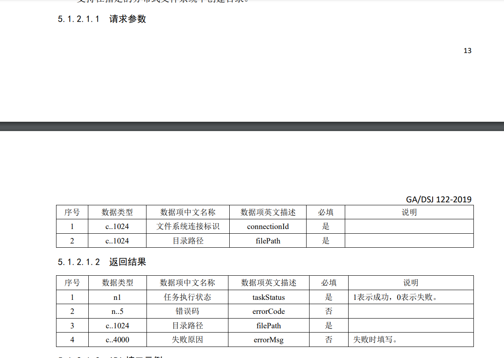

# hadoop--hdfs

## 打包命令

mvn clean install package

## 位置

### maven坐标

        <artifactId>hadoop-common</artifactId>
        <groupId>com.dsb.hadoop</groupId>
        <version>1.0.0</version>

之后生成在 ./hadoop-common/target/hadoop-common.jar,建议推送到贵司私有仓库

## 使用

将maven坐标填入,在项目application.yml填入基本参数，将会在项目启动后，注入

```
hadoop:
  fs-uri: hdfs://{hdfs_host}:{port}
  user: {user}
  config:{额外配置}
```
## 测试和截图
#### 5.1.1.1 创建文件系统连接(create)


#### 5.1.1.2 关闭文件系统连接(close)


#### 5.1.2.1 创建目录(create)



### 5.1.2.2 删除文件(delete)


### 5.1.2.3 重命名文件(rename)


### 5.1.2.4 移动文件 (move)


